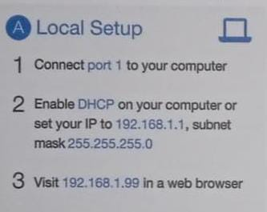
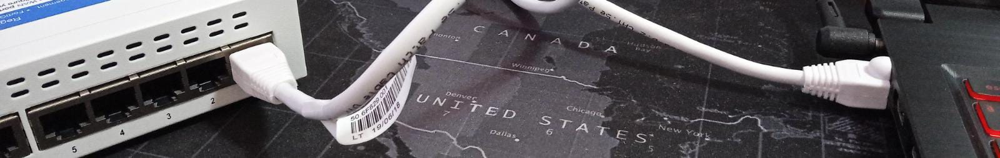
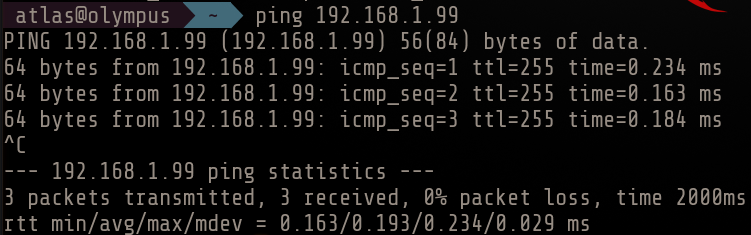
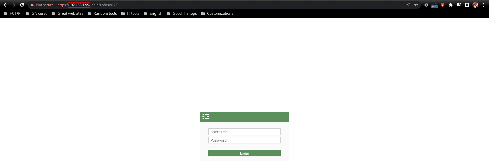
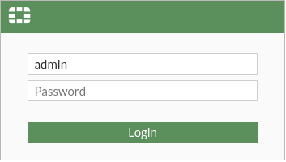
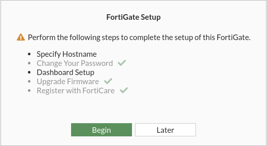
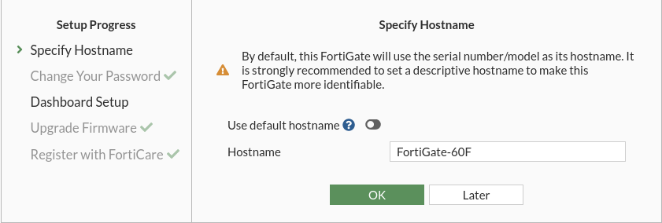
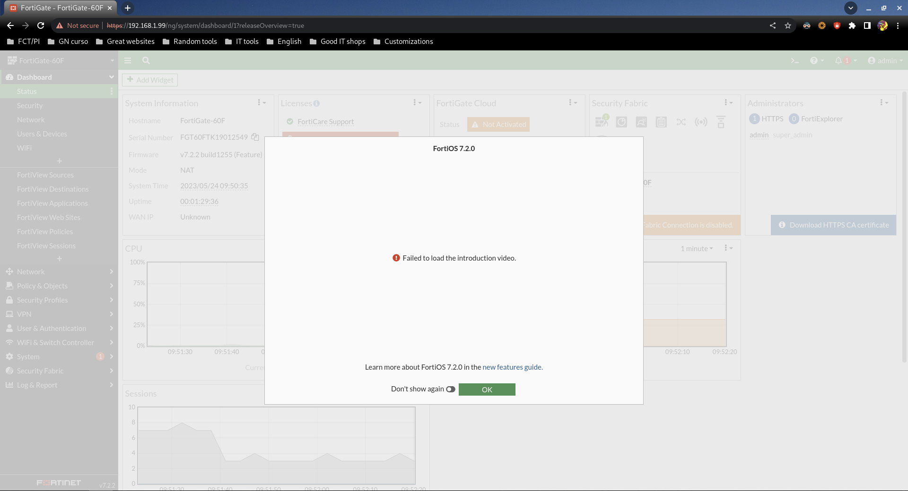

# Acceso

Teniendo ya nuestro FortiGate de fábrica, ahora tendremos que acceder.

Si recordamos, un FortiGate podía ser instalado tanto de manera local como cloud, y en el propio dispositivo teníamos las instrucciones de acceso en una pegatina.

En nuestro caso todo el proyecto será local, así que estas serán las instrucciones pertinentes:

## Paso 1

Conectamos el puerto 1 a nuestra máquina:

El propio FortiGate tiene un DHCP integrado, podemos comprobarlo viendo la IP que nos ha dado:

## Paso 2

La IP a la que tenemos que acceder es 192.168.1.99, y podemos hacer una primera prueba de conectividad:

Viendo que funciona, ya podemos acceder desde el navegador:

## Paso 3

Las primeras credenciales son las siguientes:

*(Sí, sin contraseña)*

Tras entrar nos obliga a cambiar la contraseña:

Por ejemplo le podemos poner admin también de contraseña.

## Paso 4

Nos devuelve a la pantalla de login inicial, y tras entrar con las credenciales admin admin, nos pide una pequeña configuración inicial:

El hostname es adecuado:

Con el dashboard básico nos bastaría:

Ya tendríamos acceso por completo al FortiGate:

*(Falla la carga del vídeo de introducción porque aún no tenemos configurada la salida a Internet)*
