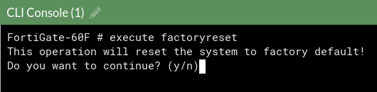
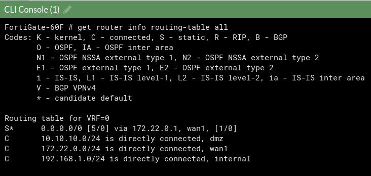
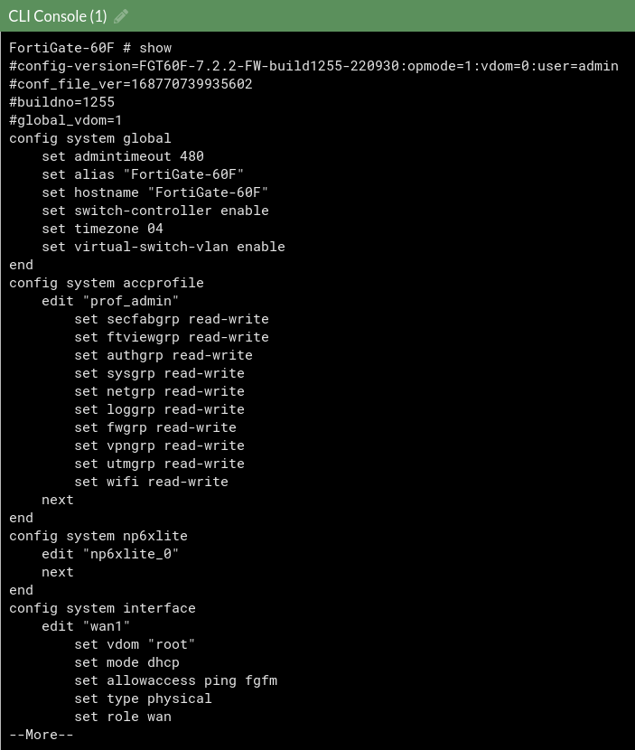
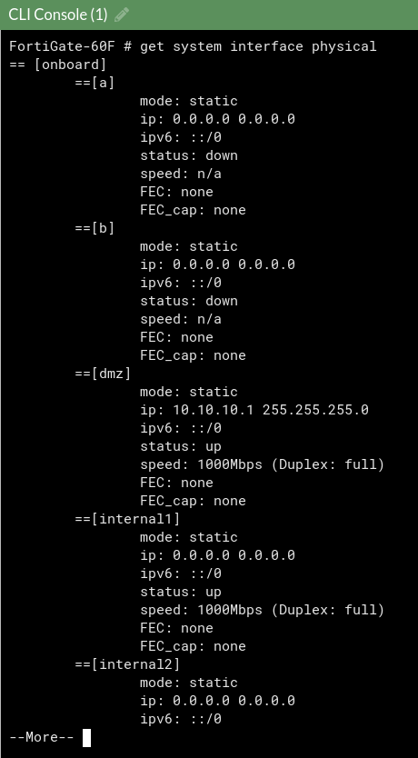
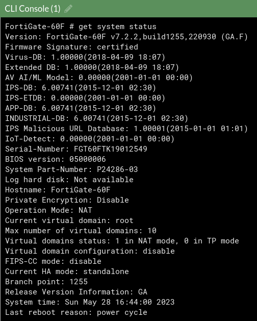
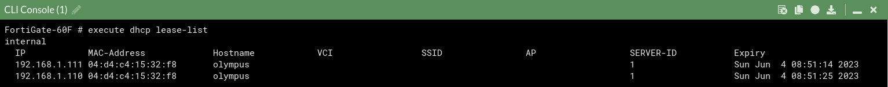
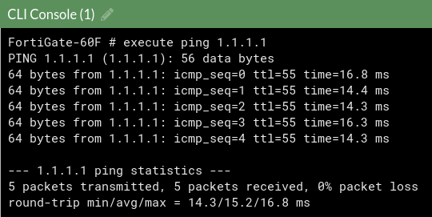
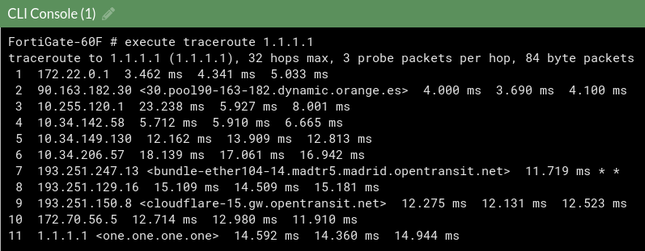
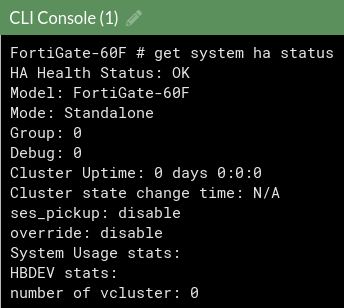

---
hide:
  - navigation
---

# CLI

En esta sección claramente no se documentarán TODOS los comandos, simplemente será un compendio resumido de los que he considerado más básicos e interesantes.

Hace la misma función que el botón de reset

Muestra todas las entradas de la tabla de enrutamiento

Muestra toda la configuración actual del FortiGate

Muestra un resumen de todas las interfaces hardware

Muestra información básica sobre el FortiGate

Muestra los leases de DHCP

Hace ping a la IP que queramos

Hace traceroute a la IP que queramos

Muestra el modo HA, en nuestro caso no tenemos así que nos indica que estamos en "Standalone"
