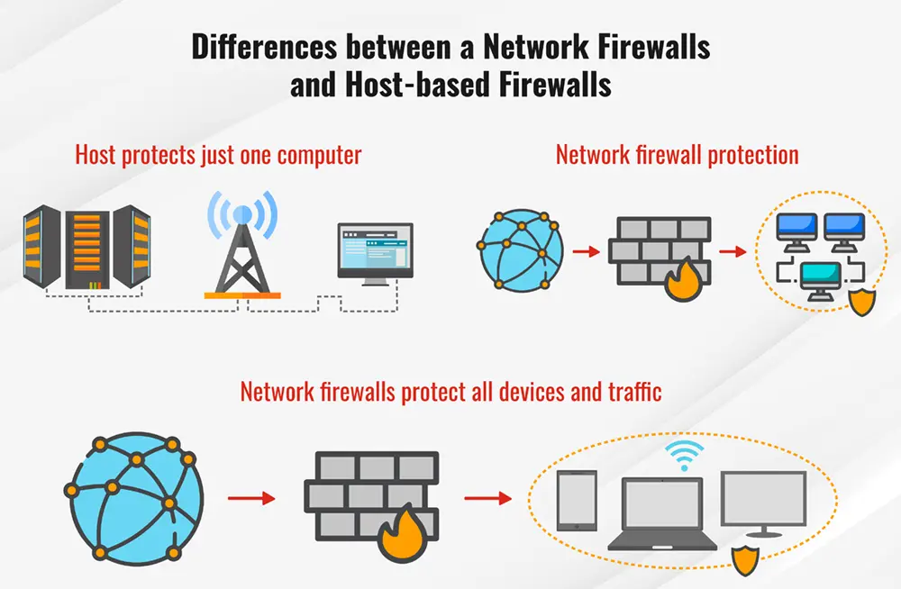

# Tipos

Depende del punto de vista, podemos considerar 2 clasificaciones de tipos.

## Por su posición en la red

* **Por nodo**: protegen solamente un nodo de la red, y existen típicamente en dispositivos personales y domésticos. También son comunes en VMs de cloud. Tienen limitaciones con respecto a la escalabilidad.
* **Perimetrales**: se colocan en el punto de entrada a una red, y la protegen al completo. Tienen gran escalabilidad por esta razón.

Aquí tenemos una imagen para ilustrarlo mejor:

## Por su capa/función

* **De capa de transporte**: filtran en esta capa, teniendo en cuenta los protocolos TCP y UDP.
* **Circuit-level gateway**: este tipo se posiciona como una capa entre la de transporte y la de aplicación del modelo TCP/IP. Por lo tanto, quiere decir que trabajan en la capa de sesión del modelo OSI. En el modelo TCP se necesita un handshake, así que este tipo de firewall examina los handshakesy corta tráfico antes de que se establezca una sesión si se considera que el tráfico es dañino.
* **De capa de aplicación**: filtran en esta capa.
* **De tipo proxy**: este tipo de firewall actúa como una máquina separada entre el cliente e Internet. Tiene su propia IP y filtra el tráfico dañino
