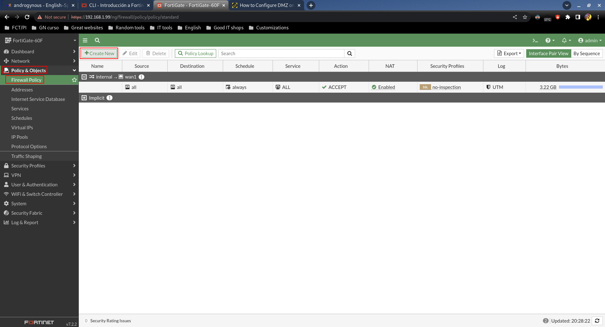

# DMZ

## Paso 1

Cambiamos la interfaz de la Raspberry a su puerto definitivo, el de DMZ:


Comprobamos desde la interfaz web que la DMZ está activada:


**La IP que vemos NO ES DE LA RASPBERRY**, es de la interfaz DMZ del FortiGate.

## Paso 2

Si vamos a la Raspberry y miramos las interfaces, nos vamos a dar cuenta de que nos ha dado APIPA:


Esto es CORRECTO. Este funcionamiento es intencional, porque generalmente no querremos tener IPs dinámicas en una zona DMZ que estará siendo accesible públicamente continuamente.

De hecho, si nos fijamos en las posibles configuraciones de la interfaz DMZ, el FortiGate ni siquiera nos deja habilitar un servidor DHCP:


¿Cómo lo solucionamos? Tendremos que asignar la IP de forma estática manualmente dentro del rango.

Dejamos `/etc/network/interfaces` de la siguiente manera:

```shell
sudo nano /etc/network/interfaces
```

```shell
# interfaces(5) file used by ifup(8) and ifdown(8)
# Include files from /etc/network/interfaces.d:
source /etc/network/interfaces.d/*

# The loopback network interface
auto lo
iface lo inet loopback
 
# The primary network interface
auto eth0
iface eth0 inet static
 address 10.10.10.2
 netmask 255.255.255.0
 gateway 10.10.10.1
 dns-nameservers 8.8.8.8 8.8.4.4
```

También modificamos el siguiente fragmento en `/etc/dhcpcd.conf`:

```shell
sudo nano /etc/dhcpcd.conf
```

```shell
# Example static IP configuration:

interface eth0
static ip_address=10.10.10.2/24
static routers=10.10.10.1
static domain_name_servers= 8.8.8.8 8.8.4.4
static domain_search=
```

Reiniciamos networking y la interfaz:

```shell
sudo systemctl restart networking
sudo ifdown eth0
sudo ifup eth0
```

Comprobamos que tenemos la IP correcta y la puerta de enlace:


Comprobamos que tenemos conectividad con la IP del FortiGate:


## Paso 3

Según la lógica que sigue el FortiGate, los dispositivos de la red DMZ no tienen salida a Internet a no ser que la habilitemos, así que la Raspberry no tiene conectividad hacia fuera.

Para habilitar esto, primero tendremos que crear un "Address object":


Básicamente lo que acabamos de hacer es definir un objeto, que no es más que un conjunto de información sobre un dispositivo. Como hemos visto hemos definido su IP, en la interfaz en la que está, etc. Luego podremos usar este objeto en las políticas que defininamos.

Es una forma de ahorrar trabajo para no tener que repetir siempre información en las políticas.

El siguiente paso será crear la política:




Ahora ya la Raspberry tendrá salida a Internet:


## Paso 4

Por ahora desde el exterior no se puede acceder al servidor web de la Raspberry, como podemos comprobar accediendo a la IP de WAN 1:


No carga, así que no se puede acceder. Falta por configurar el port forwarding.

Para ello primero tenemos que crear un "Virtual IP", el equivalente a DNAT de FortiGate:


Por último creamos la política:


Ya funcionaría, podemos acceder desde la IP de WAN 1 al servidor web:


Como vemos en la demostración, mientras que la política está activada podemos acceder, pero si la desactivamos no funciona el acceso, se queda cargando infinitamente la página.

No se ve que está cargando infinitamente porque el programa que uso peek no me deja grabar la lista de tabs por espacio en la pantalla, pero es así.
