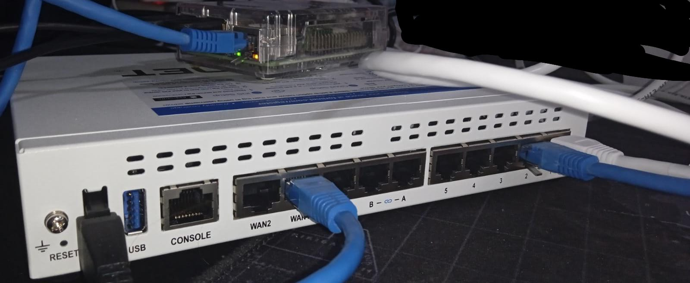

# Preparación de la Raspberry

## Tarjeta Micro SD

Lo primero será preparar la tarjeta, y para eso necesitaremos un adaptador USB:


Como ya tenía datos porque había usado anteriormente la Raspberry, vamos a hacerle un formateo con GParted:


Estando ya limpia, la prepararemos con Raspberry Pi Imager. Es un programa que nos ofrece Raspberry para dejar las tarjetas listas para usar con el SO que queramos dentro del listado que nos ofrece:


*(Raspberry Pi OS es un derivado de Debian, así que es el SO más cercano a lo acostumbrado durante el curso, y el más estandarizado para Raspberry)*


Credenciales:

* Username: pi
* Password: pi


Ya sólo esperamos.


Ya estaría la tarjeta lista para usar, y el SO personalizado con las configuraciones que hemos decidido.

## Comprobaciones

Para mostrar que la Raspberry está funcionando, vamos a conectarla al puerto 2:



Este **NO SERÁ SU PUERTO DEFINITIVO**, será el de la DMZ, pero para hacer pruebas de conectividad nos sirve.

Muestro las interfaces en el FortiGate para comprobar que el puerto 2 está funcionando:


Desde la Raspberry, podemos comprobar que le ha dado una IP con el rango correcto:


Al estar en el mismo switch que mi portátil, tendrá conectividad con la puerta de enlace e Internet sin problemas:


Las resoluciones DNS y el navegador también funcionan:


## Servidor web

Es el que usaremos para las pruebas con la DMZ.

Instalamos un Apache:

```shell
sudo apt install apache2
```

Vemos que funciona:


Cambiamos la web a algo más descriptivo:


