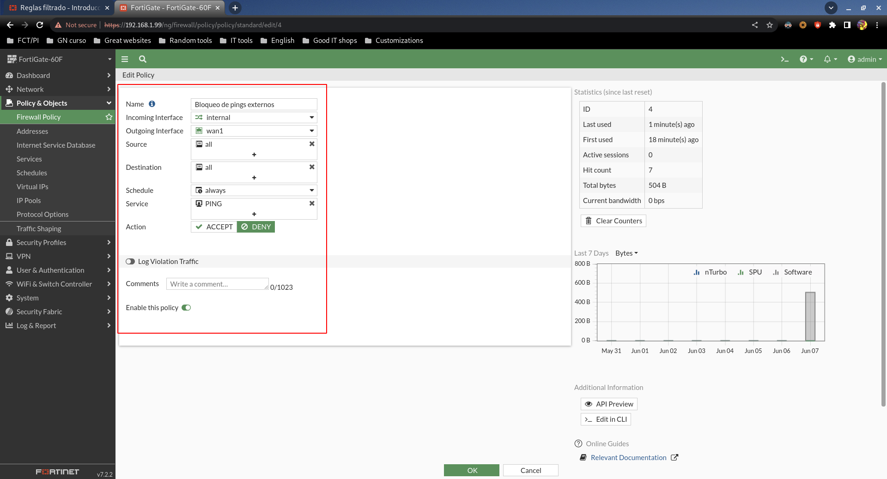
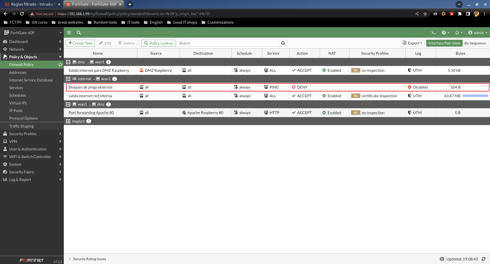
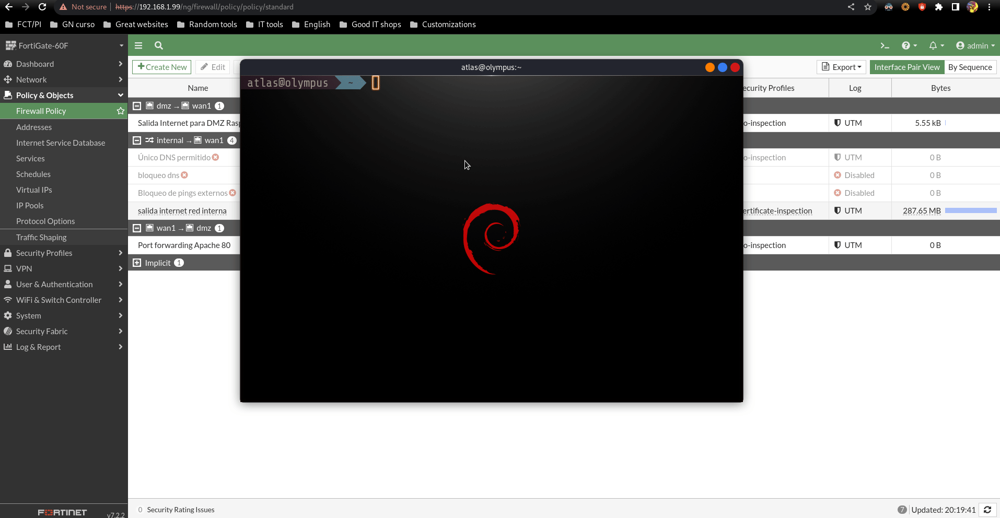

# Reglas de filtrado

Vamos a añadir algunas reglas que por defecto estarán deshabilitadas. Las iremos habilitando una a una para mostrar sus distintos funcionamientos.

## Bloqueo de pings externos

Regla a crear:

En la lista de reglas se verá así:

Con esta regla, desde la red interna (donde está mi portátil), no se podrá hacer ping al exterior.

Hagamos la prueba:

Como podemos ver empiezo la prueba con la regla deshabilitada, y el ping se permite.  
En cuanto que habilito la regla el ping que se estaba ejecutando deja de funcionar.  
Cuando vuelvo a deshabilitar la regla, el ping empieza a funcionar de nuevo.

## Exclusividad de consultas DNS

Para dar una idea general, el objetivo aquí será permitir las consultas DNS de la red interna SOLAMENTE a los DNS de nuestra red, bloqueando consultas a cualquier DNS externo.

Primero de todo necesitaremos registrar una nueva Address donde se indique nuestro servidor DNS:

En la red del instituto esta IP posiblemente habrá que cambiarla. Esta Address es la que usaremos luego en las políticas.

Pasando a las políticas, necesitaremos crear estas 2:

En el listado deberán aparecer en este orden específico:

Lo que sucederá es que si hacemos consultas DNS al servidor que tenemos especificado, hará match con la primera regla y permitirá.

En cuanto que hagamos consultas DNS a cualquier otra IP, hará match con la segunda regla y bloqueará todo el tráfico.

Además la red interna no perderá Internet porque la última regla permite todo el tráfico, pero habiendo filtrado el tráfico DNS por las primeras reglas.

Hagamos la prueba:

Empezamos con las reglas activadas y vemos que podemos hacer un dig por defecto, pero en cuanto que especificamos otros servidor DNS bloquea el tráfico.

En cuanto que deshabilitamos la primera regla ya no funciona ningún tráfico DNS porque se aplica la segunda de bloqueo general.

Si deshabilitamos la segunda regla, vuelve a funcionar todo el tráfico DNS porque ya no hay bloqueos.

## SSH interno a Raspberry

Aquí lo que querremos hacer será permitir conexiones SSH desde la red interna a la Raspberry en la DMZ, pero desde fuera no se podrá hacer SSH.

Regla a crear:

En la lista de reglas se verá así:

Hagamos la prueba:

Vemos que mientras que está la regla activada, el testeo de puerto 22 y la conexión SSH funciona, mientras que cuando desactivamos la regla deja de funcionar.
