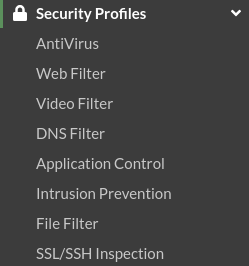
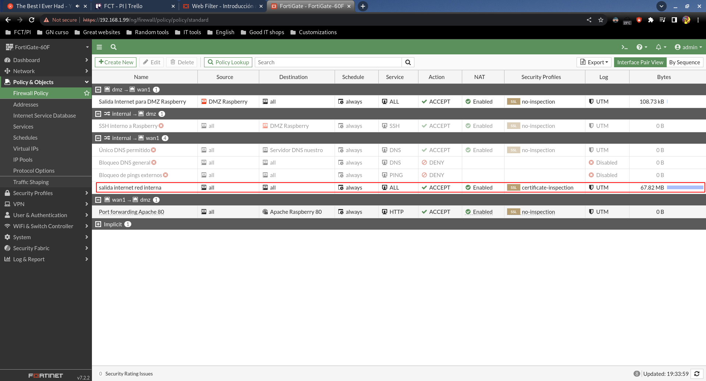
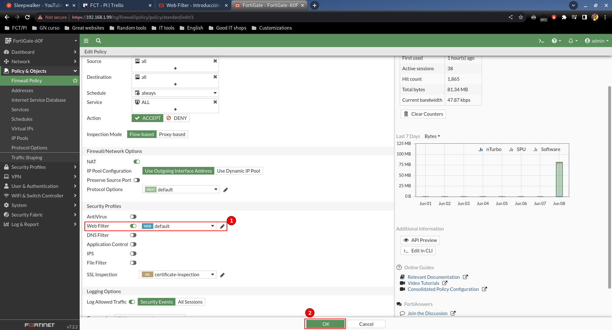
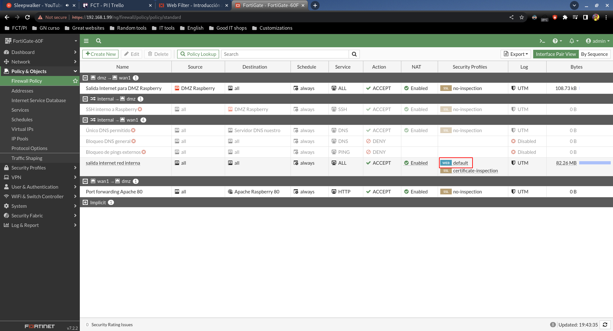

# Web Filter

Todos los Fortigate tienen los llamados "Security Profiles", que no son más que filtros que podemos aplicar en cada una de las políticas de firewall que tengamos.

Vienen ya creados por defecto, y son los siguientes:

Cada uno ya viene totalmente configurado, aunque por supuesto son modificables.

¿Cómo los aplicamos?

Primero, tendremos que decidir sobre qué política de firewall aplicamos el filtro.

Siguiendo la lógica de que queremos proteger nuestra red interna, podemos aplicarlo sobre la política de salida a Internet desde la red interna:

Una vez dentro, sólo tendremos que marcar el tick y guardar:

En la lista de reglas, nos daremos cuenta de que aparece el nuevo perfil:

Este perfil bloqueará el tráfico web según si está permitido o no, como podemos demostrar:

Como vemos, mientras que está el perfil aplicado no funciona la navegación web a un sitio de bitcoin que tiene específicamente bloqueado como bitcoin.cz.

Sin embargo cuando quitamos el perfil, vuelve a funcionar el acceso.
