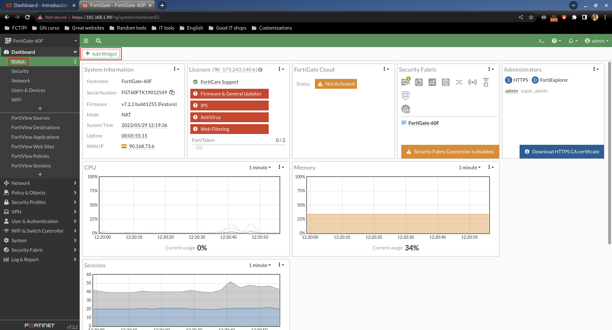
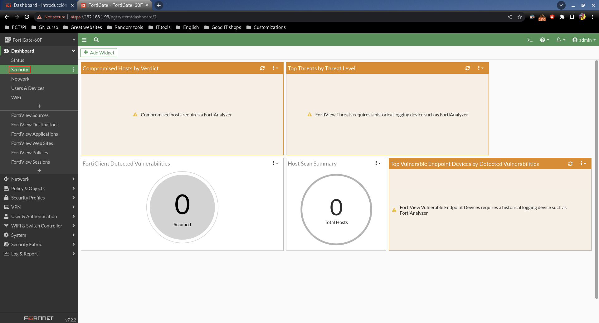
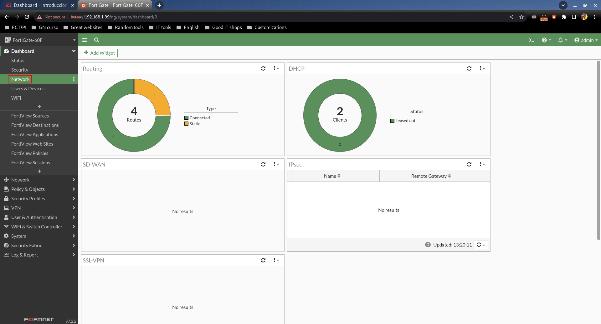
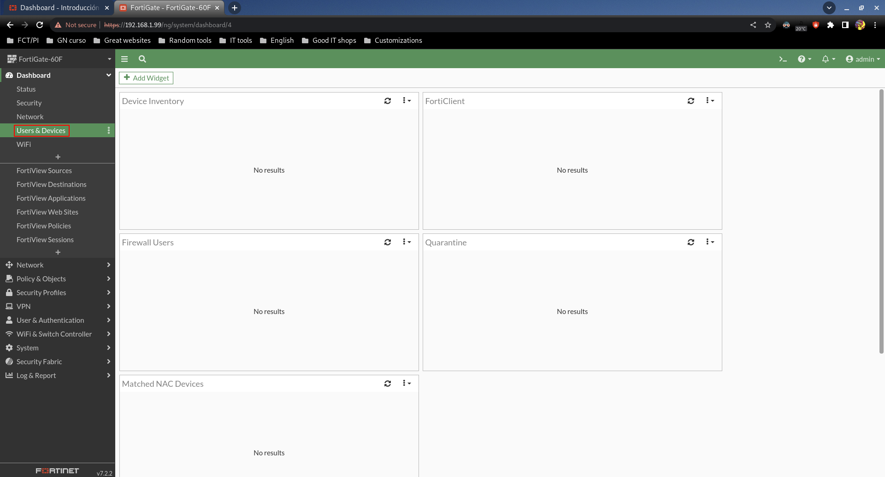
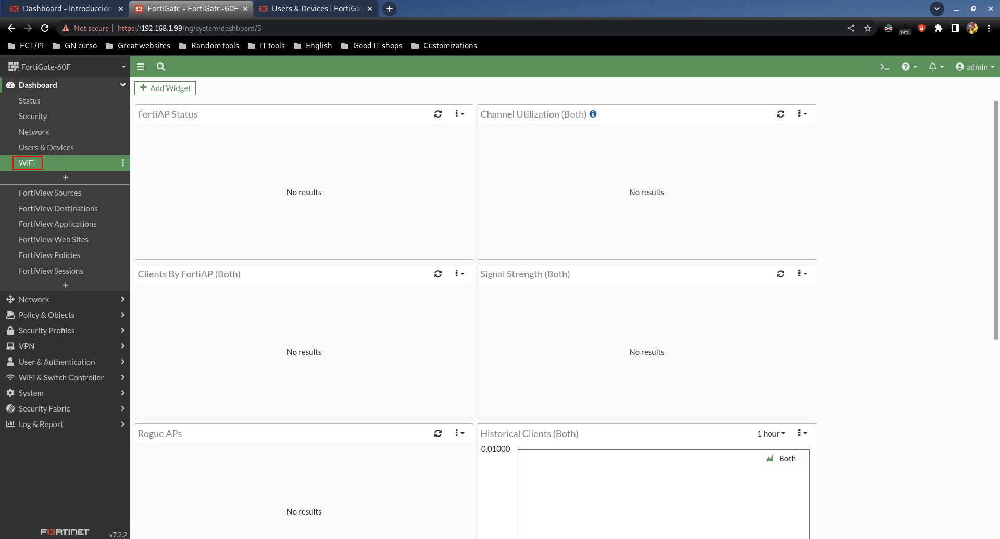
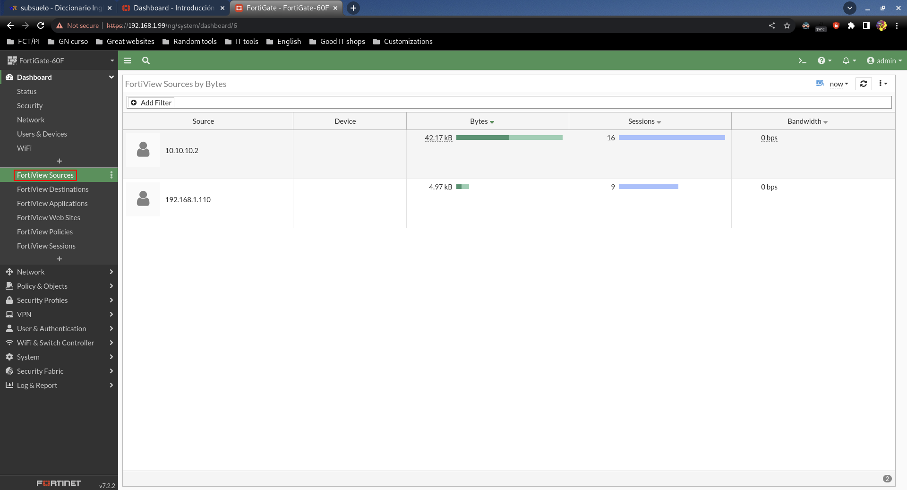
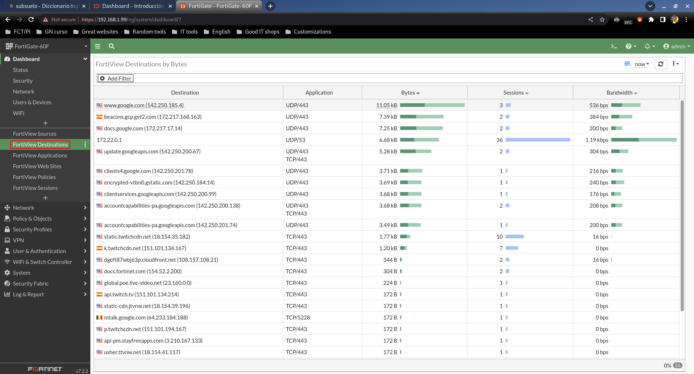
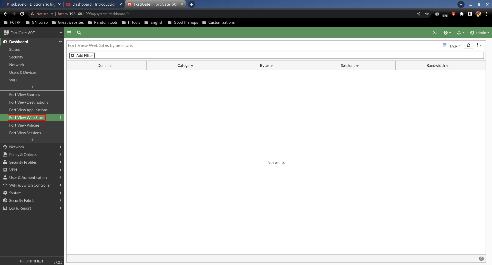
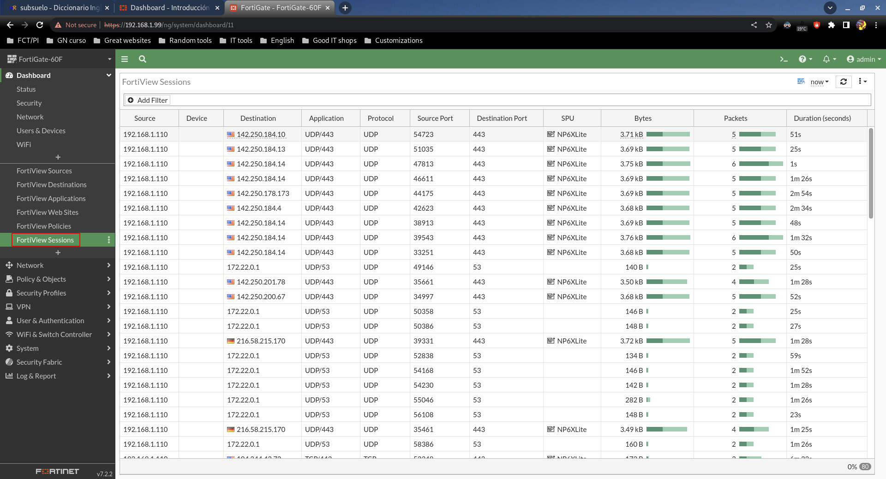

# Dashboard

## Status

Muestra información general. En "Add Widget" podemos añadir paneles adicionales.

## Security

Se muestran alertas de seguridad.

## Network

Muestra información de red como rutas, leases de DHCP, etc.

## Users & Devices

Aquí no nos muestra información porque tenemos un escenario muy básico sin dispositivos extra de Fortinet.

## WiFi

No hay información porque no tenemos puntos de acceso.

## FortiView Sources

Orígenes de tráfico en la red. En este caso son mi portátil y la Raspberry.

## FortiView Destinations

Destinos que se han visitado, por defecto ordenados por cantidad de tráfico.

## FortiView Applications

## FortiView Web Sites

## FortiView Policies

Reglas recientemente usadas, en este caso la salida a Internet.

## FortiView Sessions

Sesiones que se han establecido.
