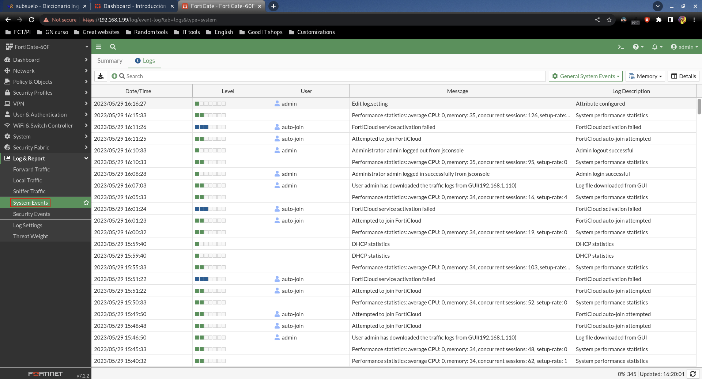
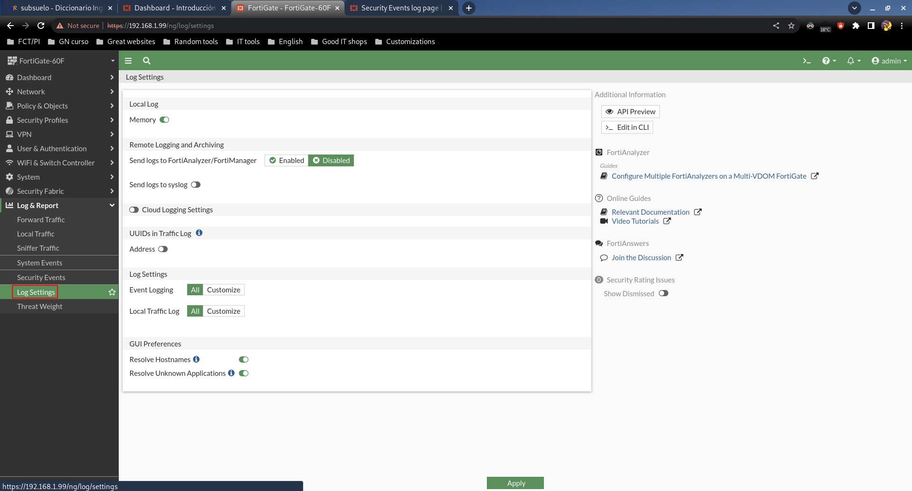
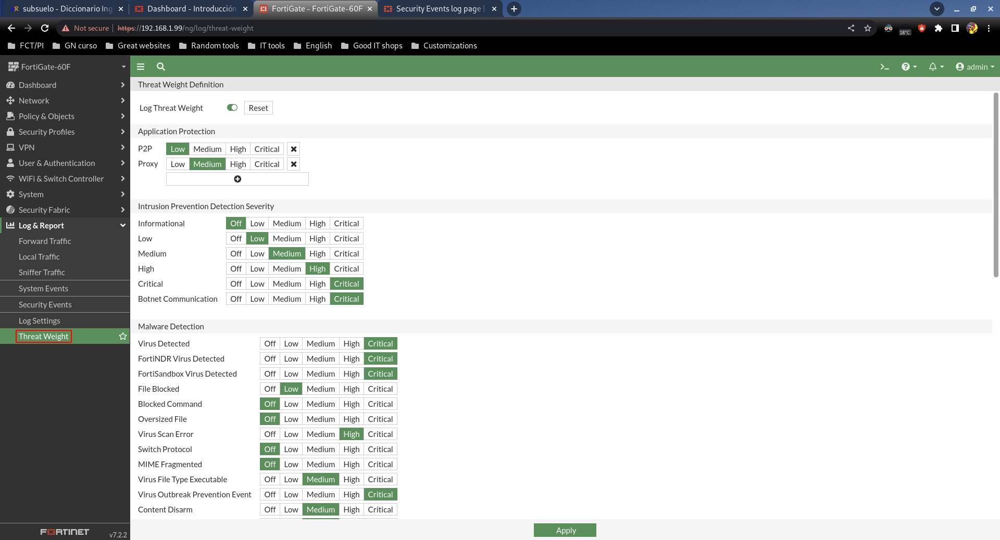

# Log & Report

## System Events

Muestra eventos de seguridad que han ocurrido, indicando su criticidad, etc.

## Log settings

Podemos configurar con qué profundidad queremos que se guarden los logs.

## Threat Weight

Por defecto el FortiGate viene con los niveles de severidad predefinidos, pero nosotros podemos cambiarlos a conveniencia.

Por ejemplo podríamos cambiar la severidad de virus a Low o incluso a Off. Pero no sería recomendable por obvias razones.
