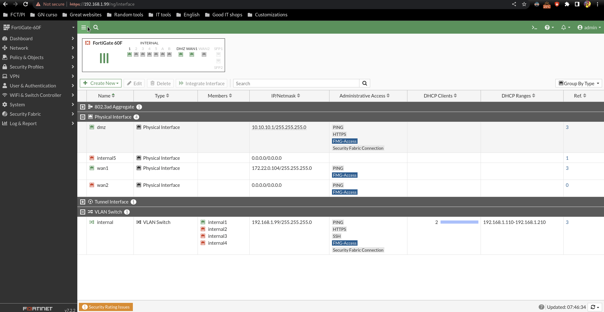
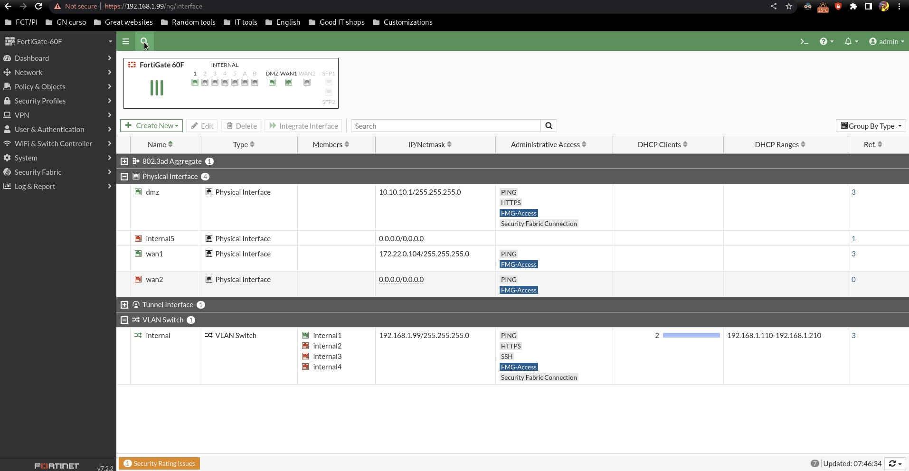
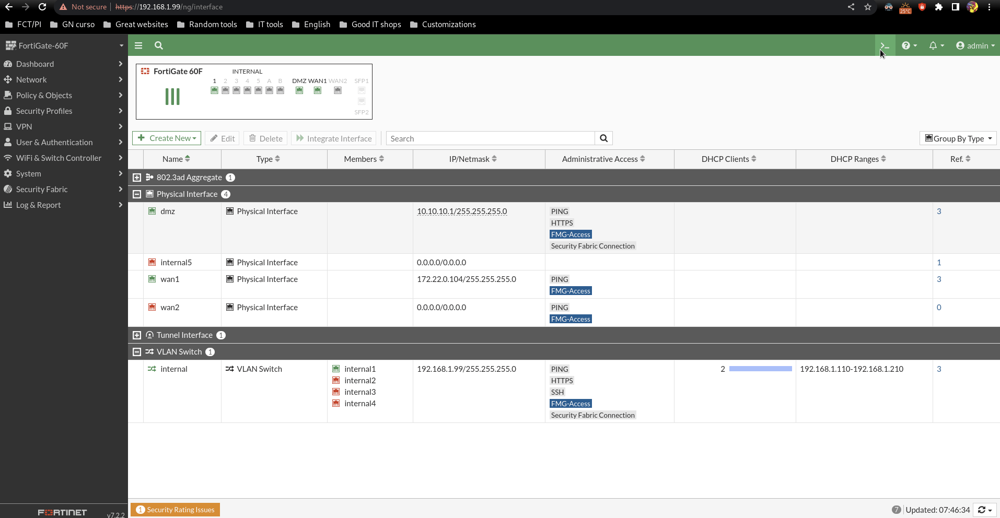
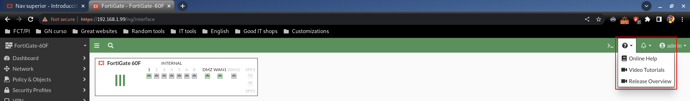
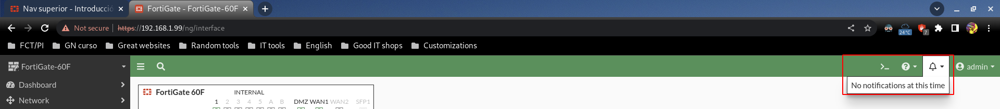
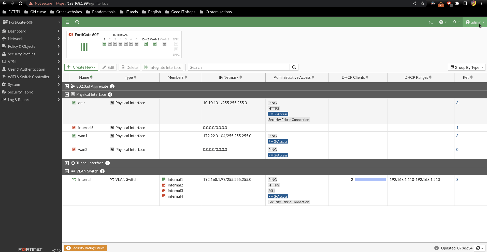

# Nav superior

Muestra/oculta el nav lateral:

Busca configuraciones y objetos:

Abre la CLI:

Muestra ayuda tanto de documentación como de vídeos:

Muestra notificaciones, ahora mismo no tenemos:

Podemos apagar/reiniciar, hacer backup y restaurar configuraciones, cambiar la contraseña del usuario...etc:

