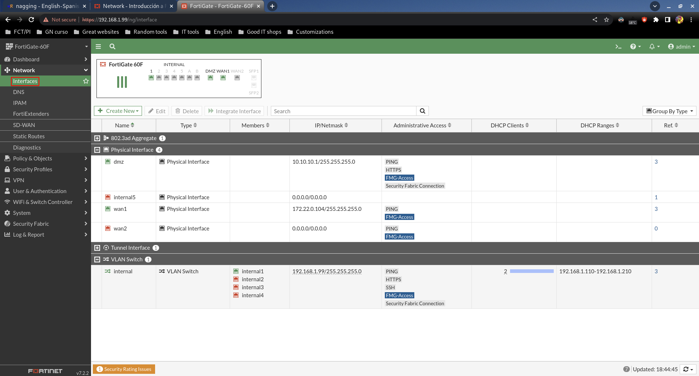
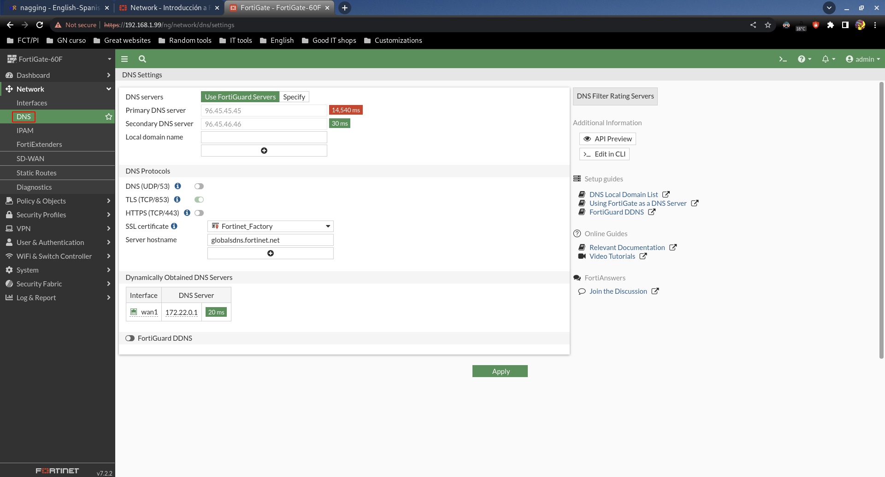
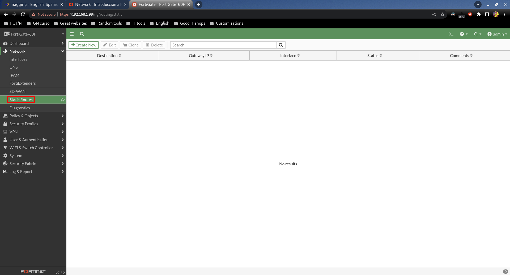
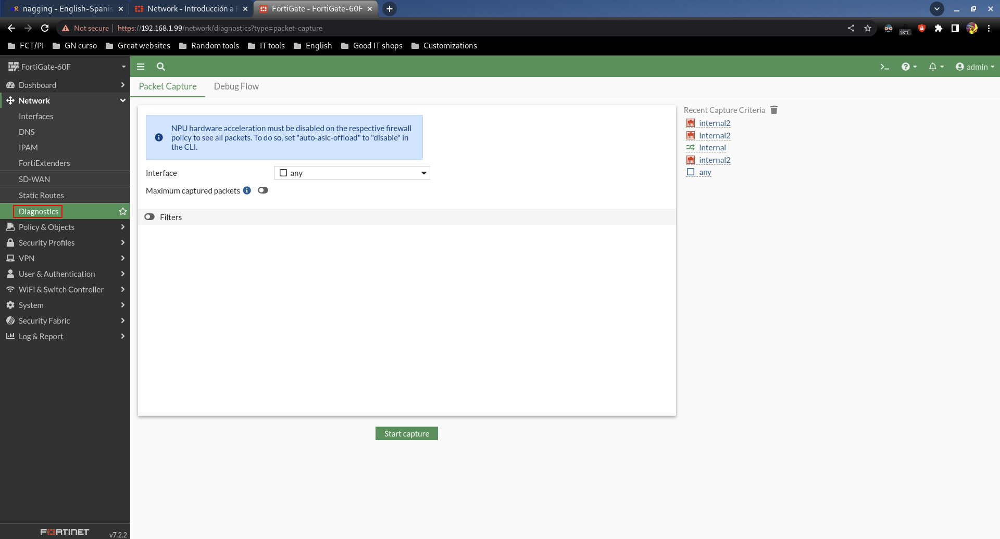

# Network

## Interfaces

Es uno de los menús que más hemos usado sin duda, y desde aquí podemos controlar todas las interfaces.

Podemos agrupar, desagrupar, crear nuevas, configurarlas...etc.

## DNS

El FortiGate tiene unos DNS por defecto que ofrecerá a los clientes DHCP, pero podemos cambiarlos.

## Static Routes

Si necesitamos crear rutas estáticas, lo haríamos aquí.

## Diagnostics

Aquí podemos capturar tráfico de las interfaces que queramos.
