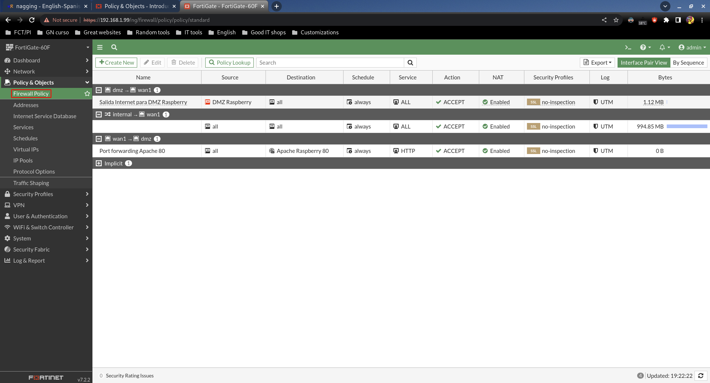
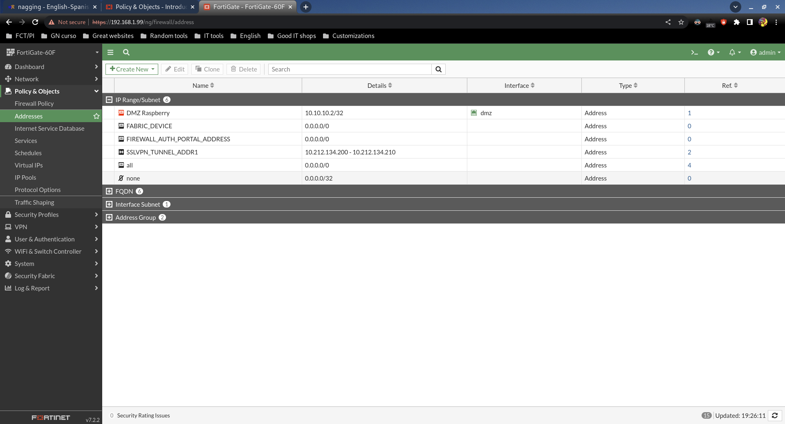
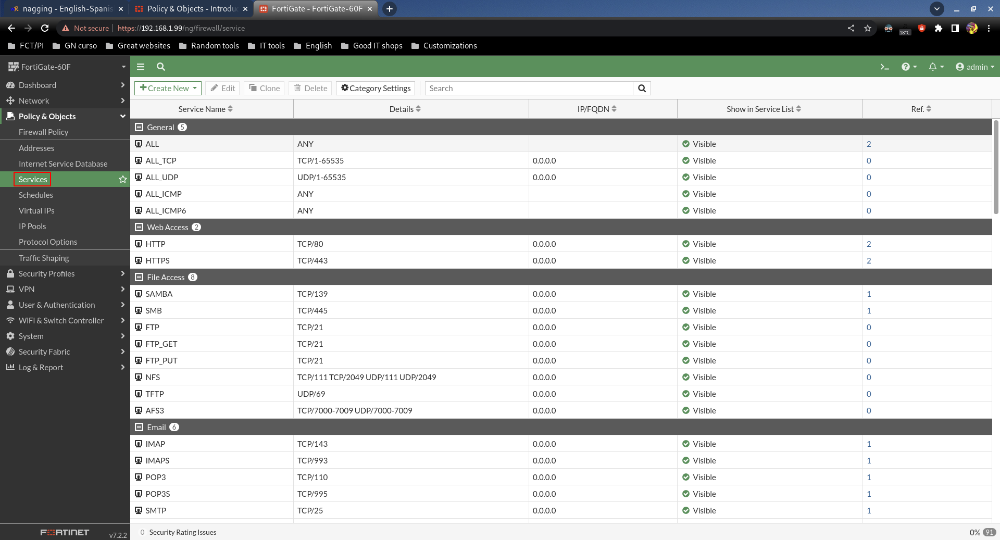
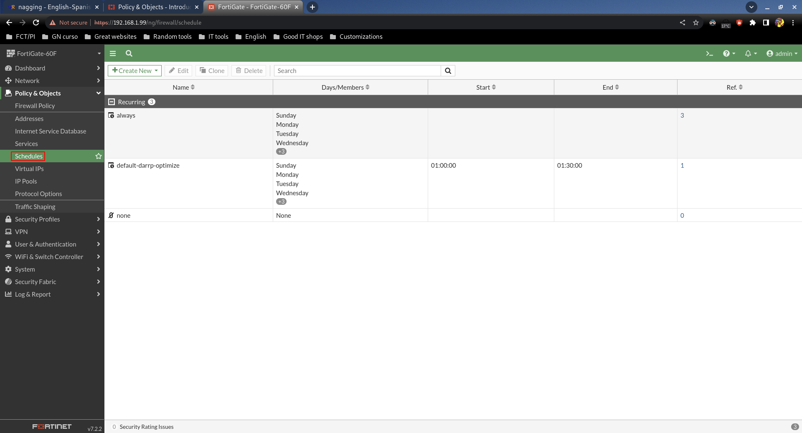
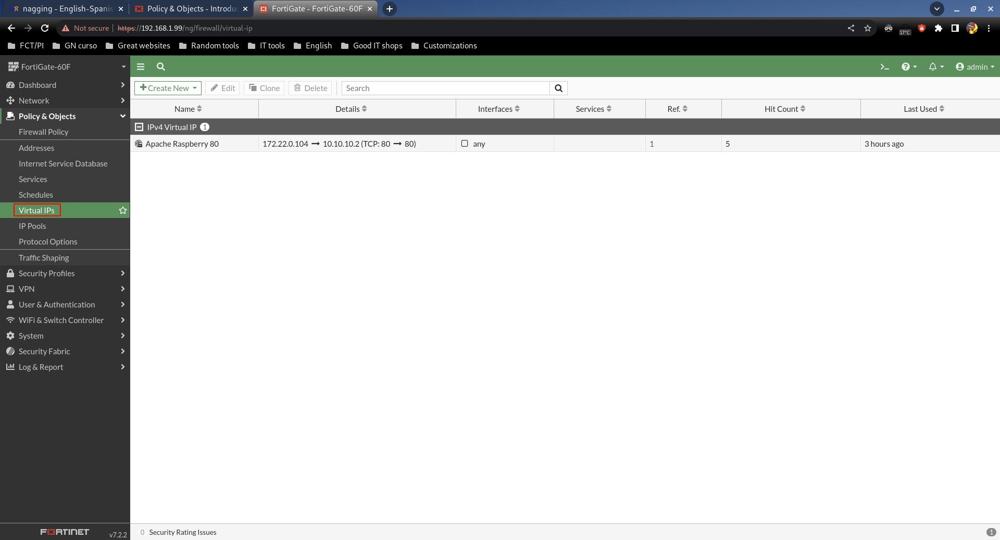

# Policy & Objects

## Firewall Policy

Aquí creamos las políticas, que vendrían siendo el equivalente a crear reglas en los firewall que ya conocemos.

## Addresses

Aquí creamos objetos con información sobre dispositivos en la red, para así luego poder usarlos en las políticas.

## Services

Aquí definimos objetos sobre puertos y protocolos, para luego usarlos en las políticas. Por defecto ya tenemos muchos creados, así que para algo básico será raro que necesitemos crear nuevos.

## Schedules

Podemos crear horarios para luego aplicar a las políticas. Los default son suficientes para un uso básico.

## Virtual IPs

Aquí podemos crear este tipo de objetos, que son básicamente DNATs. Luego podremos aplicar en políticas.
