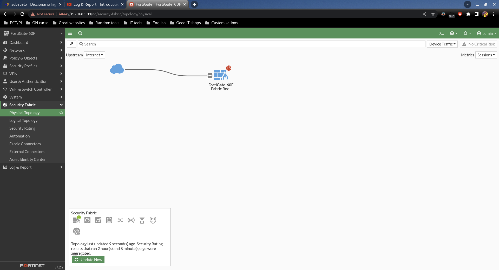
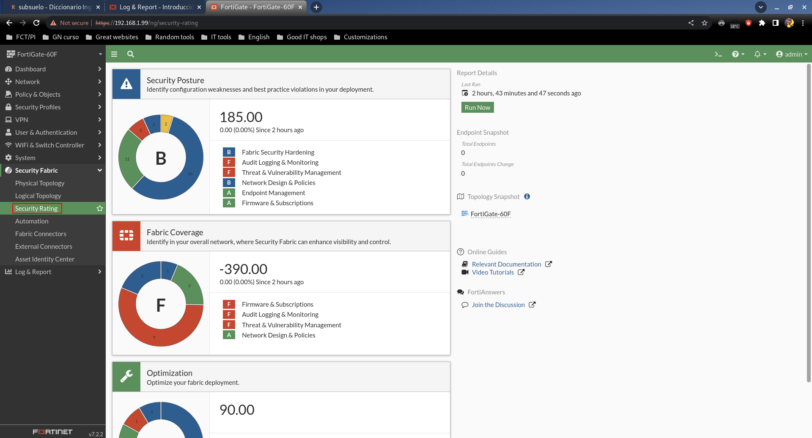

# Security Fabric

## Physical Topology

Muestra el esquema físico de red, pero como está dentro del apartado de "Security Fabric", sólo muestra lo relacionado a dispositivos de Fortinet.

Security Fabric es como se le llama al conjunto de dispositivos Fortinet: FortiAP, FortiClient...etc.

## Logical Topology

## Security Rating

Teniendo en cuenta nuestra configuración actual y muchísimas variables, el FortiGate nos da puntuaciones en distintas categorías.
