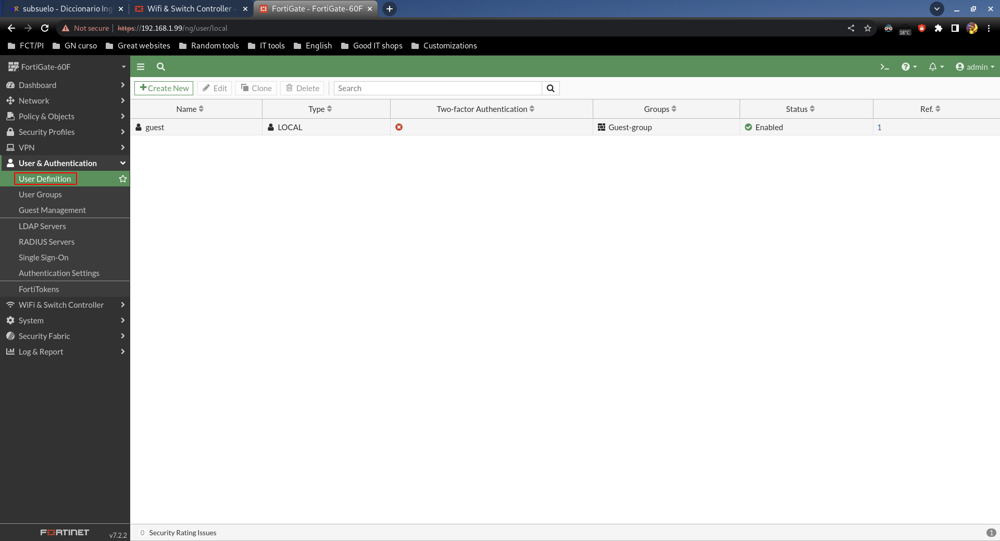
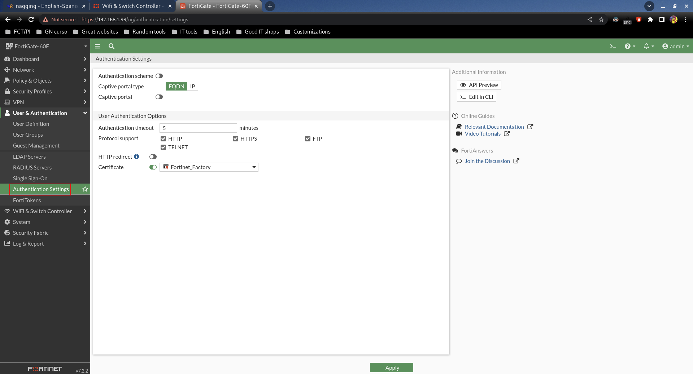

# User & Authentication

## User Definition

Muestra una lista de usuarios no admins, y permite crear nuevos desde variados orígenes como servidores RADIUS, LDAP, etc.

## Authentication Settings

Configuraciones generales sobre autenticación.
