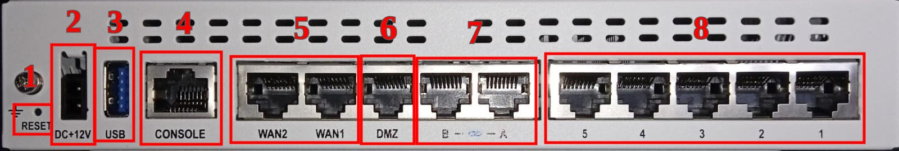
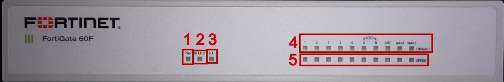

# Paneles

## Trasero

1. Botón de reset
2. Conector de alimentación
3. 1 x Puerto USB 3.0
4. 1 x Puerto consola
5. 2 x Puertos WAN GE RJ45
6. 1 x Puerto DMZ GE RJ45
7. 2 x Puertos FortiLink GE RJ45
8. 5 x Puertos internos GE RJ45

## Frontal

1. PWR
    * Verde continuo: hay corriente
    * Apagado: no hay corriente
2. STATUS
    * Verde continuo: el dispositivo tiene corriente y funciona normalmente
    * Verde intermitente: el dispositivo está arrancando
    * Apagado: el dispositivo está apagado
3. HA
    * Verde continuo: el dispositivo está funcionando en un cluster HA
    * Ámbar continuo: el dispositivo está funcionando en modo HA failover
    * Apagado: el dispositivo está funcionando en modo normal (standalone)
4. LINK/ACT (activity)
    * Verde continuo: interfaz conectada
    * Verde intermitente: interfaz con tráfico
    * Apagado: no hay enlace establecido
5. SPEED
    * Verde continuo: 1 Gbps
    * Ámbar continuo: 100 Mbps
    * Apagado: interfaz no conectada, o conectada funcionando a 10 Mbps
