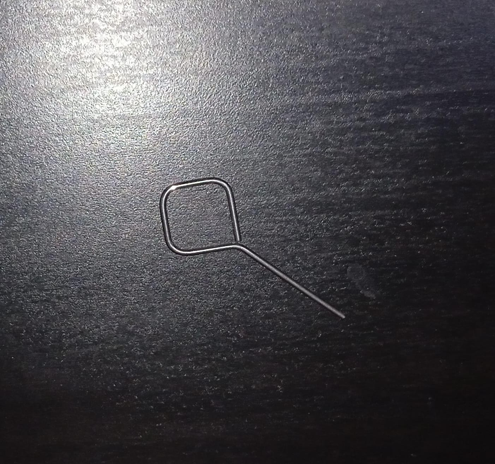
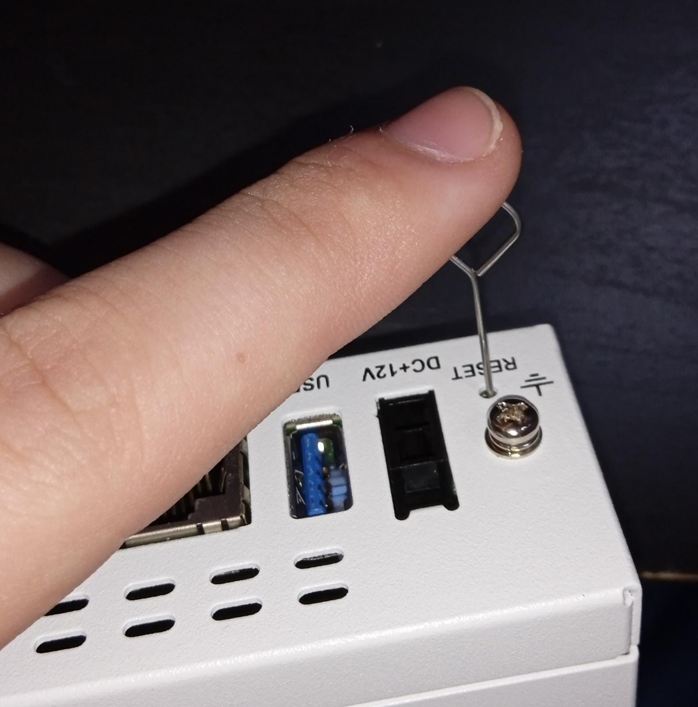

# Reseteo

En una situación ideal (recién comprado) no necesitaríamos hacer esto, pero si queremos empezar a trabajar desde 0 con un FortiGate es lo que normalmente tendremos que hacer.

Por ejemplo, en mi caso ya había sido usado antes por otra persona, así que lo mejor era resetearlo.

Aprendamos a hacerlo.

## Paso 1

Tendremos que preparar nuestro clásico alambre para poder pulsar el botón de RESET.

Por ejemplo, el pin que suele venir cuando nos compramos un móvil para abrir la ranura de la SIM nos serviría perfectamente:

## Paso 2

Conectamos el FortiGate a la corriente y esperamos a que el led de STATUS parpadee en verde.

En este momento, dejamos pulsado el botón de RESET de esta manera durante unos segundos:

El led de STATUS empezará a parpadear a más velocidad, y cuando se apague podremos dejar de pulsar.

## Paso 3

En este paso no tendremos que hacer nada, simplemente esperar a que el led de STATUS vuelva a parpadear en verde y finalmente se quede fijo.

Lo que ha hecho el botón de RESET básicamente es forzar otro ciclo de arranque.

Ya tendríamos el FortiGate de fábrica.
