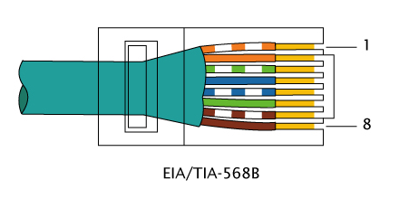

# Salida a Internet

Como todavía no tenemos acceso a Internet (sólo tenemos el portátil conectado al FortiGate), vamos a considerar el configurarlo como parte de esta sección de primeros pasos (aunque toquemos cosas de secciones más avanzadas).

## Paso 1

Vamos a conectar nuestro cable habitual de la LAN en el siguiente puerto de WAN libre, el 1:

!!! Info

    Aquí es donde viene la primera situación confusa que podemos tener tratando con un FortiGate.
    
    Todos los puertos, físicamente, son RJ45, pero la lógica se la da luego el propio SO FortiOS. Es decir, nosotros podemos configurar y agrupar las interfaces de la forma que queramos desde la interfaz web o CLI.
    
    Sin embargo de fábrica FortiOS tiene las interfaces configuradas y agrupadas para que sigan la disposición física.

    Aunque nuestro escenario no sea de WAN, podemos (**y debemos para que funcione todo correctamente**) conectar nuestra interfaz de LAN en la de WAN 1. Realmente si lo pensamos, aunque no sea una WAN directa, es nuestra salida a Internet así que tiene sentido que conectemos en este puerto.

    En los pasos siguientes veremos que FortiOS está preparado para entender esta situación.

## Paso 2

Podemos comprobar desde la web que la interfaz está funcionando:

Nos damos cuenta de que ha tomado el direccionamiento correcto por DHCP.

## Paso 3

No necesitamos nada más, conectando la interfaz al puerto correcto hará que funcione la salida a Internet. Haremos algunas comprobaciones.

Nos fijamos que la IP que tengamos no haya cambiado a la de la LAN, para así saber que luego salimos a Internet "legalmente":

Seguimos teniendo una IP de la red 192.168.1, la que nos da el puerto 1 del FortiGate, así que es correcto.

El primer paso lógico que deberíamos de hacer, antes de nada, es comprobar si desde el propio FortiGate tenemos salida a Internet. Su CLI nos permite hacerlo.

Podemos hacer ping a la puerta de enlace:

Podemos hacer ping a Internet:

Sabiendo que desde el FortiGate la conexión funciona, podemos probar ya lo mismo desde nuestro portátil:

Funciona, pero ¿por qué?, no hemos configurado ninguna ruta en el FortiGate como podemos observar:

Tendremos que mostrar la tabla de enrutamiento desde la CLI para explicarlo:

Quien haya tenido contacto con Cisco se dará cuenta de que el aspecto y nomenclatura es bastante similar.

Tenemos las 2 rutas que conoce por tener las interfaces directamente conectadas (C), y además automáticamente ha creado una ruta estática para la salida por defecto apuntando al gateway de la LAN (S*).

Esa ruta estática es la importante, y se ha creado precisamente por haber conectado la interfaz al puerto de WAN, cosa que no hubiera pasado si lo hubiéramos conectado a otros puertos.

Como dato interesante, muestro que el FortiGate ha sido lo suficientemente inteligente para en vez de darme sus DNS que tiene propios configurados, me ha dado los DNS de la LAN:

Esto sucede por esta opción que viene marcada por defecto en la interfaz WAN:

Los DNS que le lleguen sobreescribirán a los del sistema que tengamos o en nuestro caso vengan configurados:

Vemos que abajo salen reflejados los DNS que usa para sobreescribir.

!!! Warning

    En un entorno real tendríamos que tener cuidado de si este es el comportamiento que queremos con el DNS, que sobreescriba por defecto con lo que le llegue de la WAN.

    He visto por Internet que hay gente que ha llegado a tener problemas con esto, porque necesita tener los DNS propios de FortiGate o los suyos específicos.

    En nuestro caso es perfecto y no tenemos que cambiarlo porque en local queremos los DNS de nuestra red.

Comprobamos también que podemos hacer resoluciones DNS sin problema desde el portátil:

Por último enseñaré que ahora el vídeo del inicio que no cargaba en la interfaz web por no tener Internet en el apartado anterior, ahora carga perfectamente:

