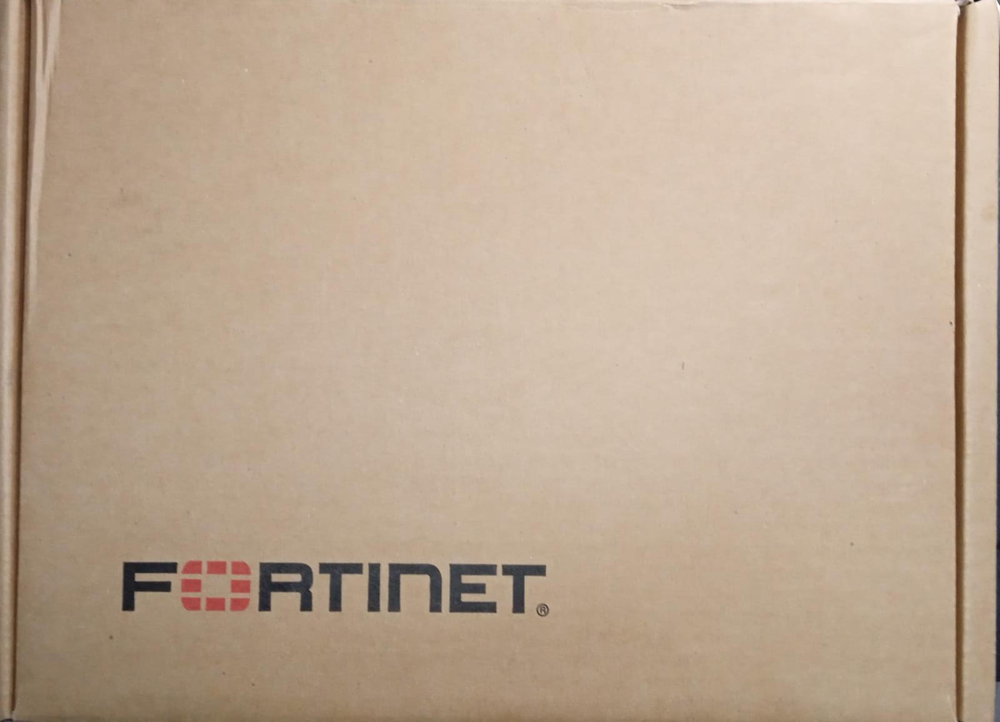
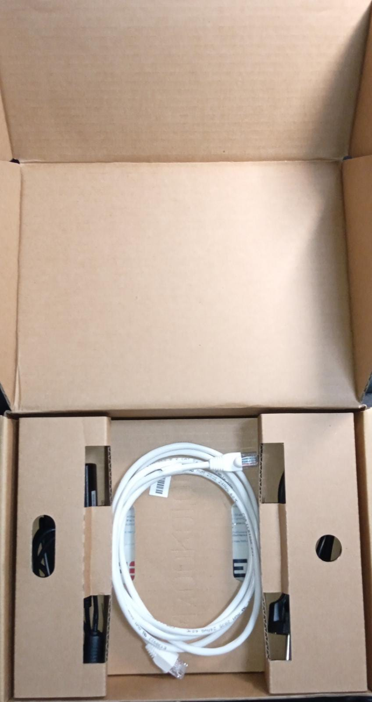
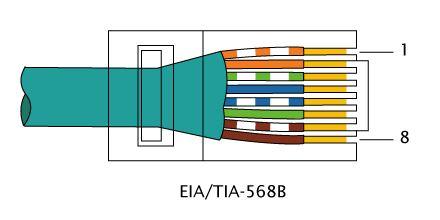
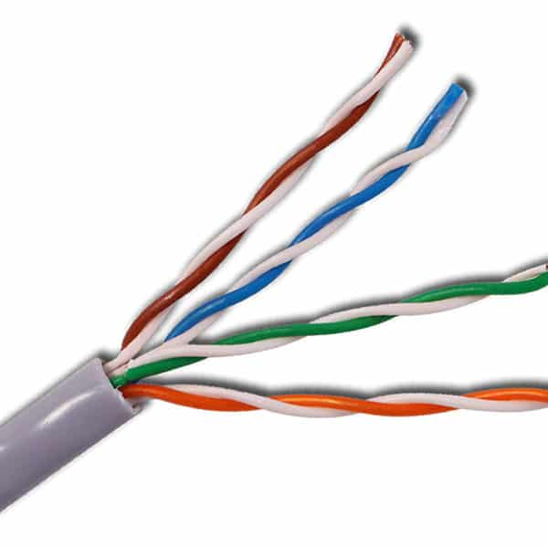
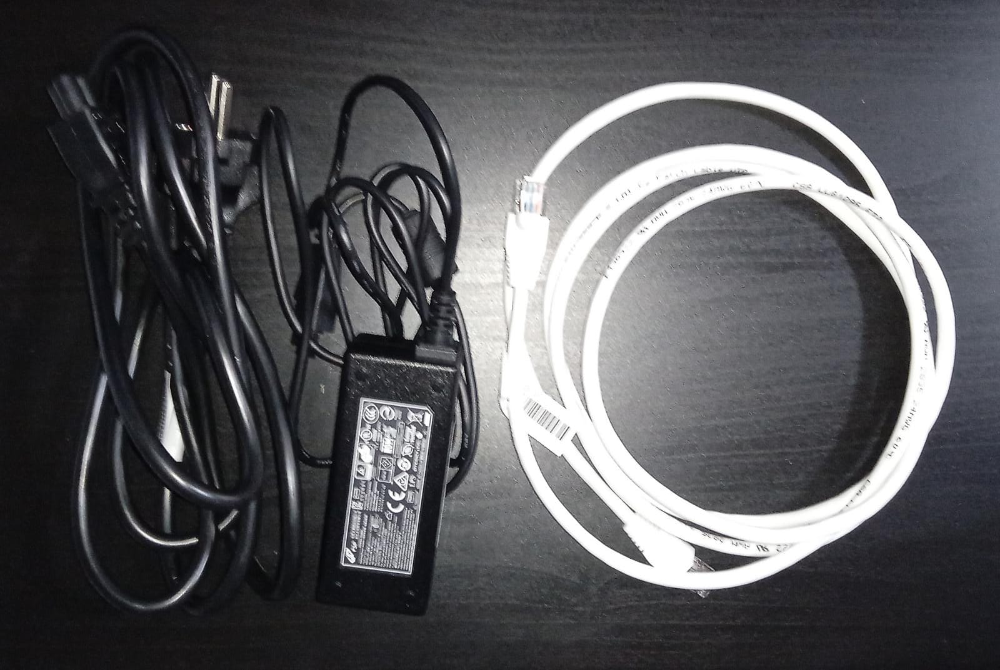

# Unboxing

Este es un apartado que dudé en añadir ya que podría verse como innecesario, pero lo veo interesante.

Al final estoy trabajando con un producto que me han prestado, pero es como si lo hubiese comprado. Como yo lo entiendo, el proyecto no empieza cuando configuramos el firewall, el proyecto empieza desde el minuto 0 cuando estamos abriendo la caja.

Así pues, empezamos.

Lo primero que nos encontramos es con una caja cuadrada muy básica, sin diseños más allá del logo de Fortinet en la cara superior.

En la cara inferior simplemente hay una etiqueta pegada con información sobre el modelo y varios códigos de barras.

Nada más abrir la caja nos encontramos con un cable Ethernet. Características:

- Tipo: TIA/EIA-568-B en ambos extremos, así que es un cable directo
- Categoría: 5e (100-350MHz, 1000Mbps)
- Protección: UTP (par trenzado sin apantallar)

Es decir es así:

Y así:

